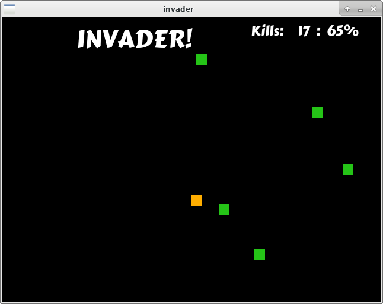

# Invader!

Invader is a simple game developed using [Allegro 5](https://liballeg.org).
It's a project in learning, so please keep any hopes in check.

## Dependencies:

- Allegro5

## Game Play

Using your keyboard (arrow keys), move around to hit the falling objects.
Collisions destroy the objects and count as a hit.

