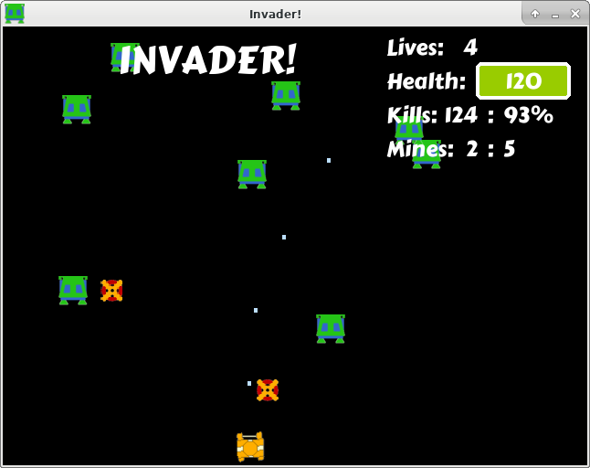

# Invader!

Invader is a simple game developed using [Allegro 5](https://liballeg.org).
It's a project in learning, so please keep any hopes in check.

## Dependencies:

- C++ compiler
- CMake
- Allegro5

## Build

Building the game is pretty straightforward. Use CMake and build in a separate
directory. This will create an invader executable in the bin directory.

    mkdir build
    cd build
    cmake ../CMakeLists.txt
    make

Build has been tested on Linux and Windows using MingW.

## Game Play

Run the game from the same directory as the resources folder.
Using your keyboard (arrow keys), move around to hit the falling objects.
Collisions destroy the objects and count as a hit.

